## You Deploy a CODEOWNERS File. Things Break.

Ever deployed a CODEOWNERS configuration only to watch your CI/CD pipeline grind to a halt because the approval workflow is now completely broken? You've got 15 people assigned to a file that needs 3 approvals, GitLab won't let you merge anything until the rules make sense, and you're frantically trying to debug whether `[Section][2]` means "2 approvals in this section" or "2 approvals total" (spoiler: it's the first one, and no, you won't remember that at 2am).

CODEOWNERS files are powerful tools for code governance. They automatically assign reviewers based on file patterns, enforce approval counts, and create approval workflows. But they're also a minefield. The syntax is unforgiving, the logic is non-intuitive, and testing them means... well, deploying them and hoping nothing explodes.

This is the story of how I built a tool to fix that. It's a browser-based CODEOWNERS simulator that lets you test your configurations before they hit production. Along the way, I discovered that GitLab's section-based approval logic is even more complex than I thought, learned some hard lessons about performance optimization, and realized that sometimes the best backend is no backend at all.

## The Problem With CODEOWNERS (And Why We Need Them Anyway)

Code ownership files exist for good reason. They enforce code review policies, distribute review responsibilities, and ensure domain experts validate changes. For teams of any significant size, they're essential.

But testing them? That's where things fall apart.

**Your options are delightfully terrible:**

1. **Trial-and-Error in Production** — Deploy the file and watch merge requests fail spectacularly. Hope your team doesn't mind being guinea pigs. Spoiler: they absolutely do, and they will remind you about it.

2. **Cloud-Based Tools** — Paste your internal CODEOWNERS file into some random web tool. What could go wrong? Privacy teams absolutely love this. (They don't. Your security lead will have opinions, many of them strongly voiced.)

3. **Just Guess** — Read the documentation three times, stare at your syntax until your eyes glaze over, convince yourself it's correct, and hit deploy. 50% success rate. Terrible odds.

**And Then There's GitLab Complexity**

If you're using GitLab (not GitHub), you've got an extra layer of fun. GitLab introduced "sections" to CODEOWNERS as a way to organize approval requirements and create complex workflows. Instead of just listing owners, you can do things like:

```
[Backend]
*.py @backend-team

[Documentation][2]
*.md @writer1 @writer2 @writer3 @writer4
```

This means different reviewers are required depending on which file is being modified, approval counts vary by section, and the logic for "all approvals satisfied" becomes... let's just say "surprisingly non-obvious." GitLab uses "last match per section" semantics. The last matching pattern in each section wins, and different sections have different approval requirements. Combine that with optional sections, default owners, and approval count requirements, and you've got a system that's powerful but brutal to reason about.

And here's the kicker: no tools existed to test this. Not a single one. The documentation exists, yes. Tools? Radio silence.

## Here's What I Built

I created [codeowners.dev](https://codeowners.dev), a browser-based CODEOWNERS simulator that runs entirely in your browser. No servers. No accounts. No data leaving your machine. You paste in your CODEOWNERS file, add mock files you want to test, and the tool shows you exactly who needs to approve what and why.

**Core Features:**

- **Real-time Parsing** — Write your CODEOWNERS file and see validation errors immediately
- **Five Different Views** — Depending on how your brain works, you can see reviewer assignments as a list, a file breakdown, a rule explanation table, summary statistics, or an interactive approval simulator
- **Approval Simulation** — Pick approvers and watch as the tool tells you whether a file would be approved, section by section
- **100% Client-Side** — Everything happens in your browser. Your CODEOWNERS file never leaves your machine. Privacy isn't an afterthought; it's the entire architecture

**The Tech Stack:**

- **React 19** with TypeScript (strict mode, because suffering builds character)
- **Vite** for the build tooling (it's scary how fast it is)
- **Picomatch** for glob pattern matching (you'll appreciate this choice when you hit performance)
- **Pure CSS** because some of us are masochists
- **Cloudflare Pages** for hosting (no server needed, remember?)

The "no backend" part isn't laziness. It's deliberate architecture. Developers are (rightfully) paranoid about pasting internal files into cloud tools, and asking them to trust some random person's infrastructure is a losing bet. By running everything in the browser, you know for certain that your configuration stays private. You can verify it with the open source code. You don't have to trust my infrastructure; you can inspect the code yourself. That's the whole point.

## How It Works: The Three-Layer Architecture

Building a CODEOWNERS simulator is trickier than it sounds. The tool needs to:

1. **Parse** the CODEOWNERS syntax without choking on edge cases
2. **Match** file patterns against parsed rules (and do it fast)
3. **Calculate** whether files are approved based on section requirements

Each of these is its own rabbit hole. Here's how I built them.

#### Architecture Overview

```mermaid
flowchart TD
    A["📝 Input<br/>CODEOWNERS File + Test Files"] --> B["<b>Layer 1: Parser</b><br/>Syntax Validation<br/>Extract Rules &amp; Sections"]
    B --> C["Parsed Rules<br/>Line-by-line Errors"]
    C --> D["<b>Layer 2: Matcher</b><br/>Auto-detect Mode<br/>Pattern Matching"]
    D --> E["Mode Decision:<br/>Simple vs<br/>Section-Aware"]
    E --> F["Section Matches<br/>Last Match per Section"]
    F --> G["<b>Layer 3: Approval Logic</b><br/>Calculate Approval Status<br/>Check All Sections"]
    G --> H["✅ Output<br/>Approval Results<br/>Section by Section"]

    style A fill:#e1f5ff,stroke:#01579b,stroke-width:2px,color:#000
    style B fill:#fff3e0,stroke:#e65100,stroke-width:2px,color:#000
    style C fill:#f1f8e9,stroke:#558b2f,stroke-width:2px,color:#000
    style D fill:#f3e5f5,stroke:#4a148c,stroke-width:2px,color:#000
    style E fill:#f3e5f5,stroke:#4a148c,stroke-width:2px,color:#000
    style F fill:#f3e5f5,stroke:#4a148c,stroke-width:2px,color:#000
    style G fill:#e8f5e9,stroke:#1b5e20,stroke-width:2px,color:#000
    style H fill:#c8e6c9,stroke:#1b5e20,stroke-width:2px,color:#000
```



### Layer 1: The Parser

GitLab CODEOWNERS syntax supports:
- Glob patterns (wildcards, character classes, recursive patterns)
- User references (`@username`)
- Team references (`@group/team-name`)
- Email addresses (`user@example.com`)
- Section headers (`[Section Name]`)
- Optional sections (`^[Optional Section]`)
- Approval count requirements (`[Section][2]`)
- Section default owners

Parsing this correctly is non-trivial. A naive approach would break on edge cases:

```typescript
// Simplified example of section header parsing
// Pattern: [SectionName] or [SectionName][ApprovalCount] or ^[SectionName]
const sectionPattern = /^\^?\[([^\]]+)\](?:\[(\d+)\])?$/
const match = sectionPattern.exec(line)

if (match) {
  const [, sectionName, approvalCount] = match
  const optional = line.startsWith('^')
  // Now you have structured section data
}
```

The parser also validates aggressively. You get line-by-line error reporting with severity levels. Is `@group/team-name/extra/stuff` too many slashes? Invalid. Is the approval count negative? Also invalid. The goal is to catch mistakes before they hit production.

Performance matters here. The parser includes a 300ms debounce to prevent re-parsing on every keystroke, and it enforces a 1MB file size limit (because some teams like to test limits, apparently). Performance monitoring built into development mode warns you if parsing takes over 500ms. That's a sign that something is inefficient.

### Layer 2: The Matcher (With Automatic Mode Detection)

Here's where things get clever. The matcher needs to support two completely different approval models, and they're not just different. They're fundamentally incompatible:

**Simple Model:** All matching patterns contribute to reviewer assignments. If file `api.py` matches both `*.py @alice` and `api.py @bob`, then both Alice and Bob are required reviewers. It's cumulative.

**Section-Aware Model:** Only the last matching pattern *per section* contributes. If you have:
```
[Backend]
*.py @alice
api.py @bob
```

Then for `api.py`, only Bob is assigned (from the Backend section). Alice is ignored. Later matches override earlier ones.

These are fundamentally different behaviors, and using the wrong one would silently break your approval workflow. So how do you know which model to use? The tool's elegant solution: **automatic detection**. If any rule has a section header anywhere in the file, switch to section-aware logic. Otherwise, use simple logic. This means simple CODEOWNERS files work as expected while complex section-based files work correctly too. No configuration required.

The section-aware matching uses a map to ensure "last match per section" semantics:

```typescript
// Simplified matcher logic
const sectionMatchMap = new Map<string, MatchedRule>()

for (const rule of parsedRules) {
  if (patternMatches(rule.pattern, file)) {
    const sectionKey = rule.sectionName ?? 'DEFAULT'
    // This overwrites previous matches in the same section
    sectionMatchMap.set(sectionKey, rule)
  }
}

// Result: one rule per section that matched, last one wins
```

This creates one `SectionMatch` per section, ensuring accuracy when calculating approval requirements.

### Layer 3: Approval Logic

Once you know who's assigned to each section, you need to determine whether a file is approved. The logic is:

- A file is approved when **all non-optional sections** are satisfied
- A section is satisfied when `approvedCount >= requiredApprovals`
- Optional sections (`^[Section]`) don't block approval

For the example:
```
[Backend][1]
*.py @alice @bob

[Documentation][2]
*.md @writer1 @writer2 @writer3
```

File `guide.md` requires:
- 1 approval from a Backend owner (only applies if Backend matched)
- 2 approvals from Documentation owners (requires any 2 of the 3)
- Total minimum: depends on which files matched

The approval simulation UI shows you this in real-time. You pick approvers, the tool tells you the approval status, section by section. It's like having a CI/CD pipeline simulator that actually makes sense.

## Building This Thing: The Challenges

### GitLab Sections Are More Complex Than They Appear

Honestly? I massively underestimated this. The CODEOWNERS syntax documentation exists, sure. But the *semantics* of how sections interact with approval logic? That's where the documentation gets fuzzy. Do optional sections in different groups block each other? What happens if you require 5 approvals but only have 3 owners? Can the same person be an owner in multiple sections? (Spoiler: yes, but the implications aren't obvious.)

I ended up writing a 482-line markdown file documenting GitLab sections just to understand the system well enough to implement it correctly. It's probably overkill. Definitely overkill, actually. But it's also thorough enough that once you read it, the system starts to make sense. Sometimes understanding requires documentation that's almost aggressively detailed.

### Performance: The Picomatch Discovery

The initial implementation used `minimatch` for glob pattern matching. It worked, yes. But performance was... well, let's just say "sluggish." Parsing a moderately complex CODEOWNERS file against a large file list would take several seconds. Not catastrophic, but noticeable enough that the UI felt laggy.

Then I discovered `picomatch`. It's a glob matching library that's 2-7x faster than minimatch for typical patterns. Switching to it was a revelation. Suddenly the UI felt responsive. Pair that with debouncing (parsing only happens when the user stops typing for 300ms), and you get something that feels *fast*.

The 1MB file size limit is also deliberate. Browsers aren't designed to crunch massive files, and honestly, CODEOWNERS files don't need to be massive. For the 99% of users with reasonably-sized files, it's no problem. For that one team with a 5MB monorepo CODEOWNERS file... I genuinely don't know what you're doing, but I respect the commitment to testing the system's limits.

### Privacy-First Architecture

I want to be crystal clear: **there is no backend**. No servers storing files. No logs of what you're testing. No tracking of your CODEOWNERS content. Cloudflare collects standard web analytics (page views, that sort of thing), but your actual configuration and test data? That stays in your browser.

This isn't altruism; it's pragmatism. Developers are (reasonably) paranoid about pasting internal CODEOWNERS files into random cloud tools. They shouldn't have to trust my infrastructure to keep their configuration private. By processing everything client-side, the tool respects that privacy concern without requiring you to take it on faith. You can read the source code yourself.

The tradeoff? You can't share simulation results easily. You can't save your configurations. If you reload the page, your test setup vanishes. These limitations exist because the benefit (guaranteed privacy, no trust required) is genuinely worth it.

### UI/UX: Five Different Mental Models

Here's the thing about code ownership: different people think about it completely differently. So the tool has five different views:

1. **Reviewers List** — Who's assigned to what, at a glance
2. **File Breakdown** — Which patterns matched which files, rule by rule
3. **Rule Explanations** — A detailed table showing pattern → file → owners for every match
4. **Summary Statistics** — High-level aggregates (average reviewers per file, coverage, etc.)
5. **Approval Simulation** — The interactive tester where you actually pick approvers and watch the status change

Why five? Because developers think about this stuff differently:

- Some think in patterns: "Which rules apply to this codebase?"
- Others think in files: "Who needs to review this specific file?"
- Some want to see the approval flow in exhaustive detail
- Others just want the summary numbers
- And some want to *experience* the approval process interactively

Supporting all these mental models without turning the UI into an overwhelming mess was tricky. The tabbed interface lets you pick the view that matches how your brain works.

There's also a theme toggle (light/dark/auto) because developers have *strong opinions* about dark mode, and those preferences persist to localStorage so your choices survive a reload.

## What Went Well, What Didn't, What I'd Change

**The Good:**

TypeScript strict mode caught a *ton* of edge case bugs before they could cause runtime issues. The three-layer architecture kept the code organized and testable. And here's something I didn't expect: writing extensive documentation (the PRD, the 482-line sections guide) actually forced me to understand the problem deeply enough that implementation became *easier*, not harder.

The privacy-first architecture resonates with users. You'd be surprised how much people appreciate tools that don't require them to trust external infrastructure.

Automatic mode detection was an elegant solution to a hard problem: supporting both simple and section-aware CODEOWNERS files without configuration or user decisions. It Just Works™.

**The Hard:**

GitLab sections are complex, and I massively underestimated that complexity. The nuance in how multiple sections interact (different approval counts, optional statuses, section-aware matching) is deeper than the documentation suggests.

Performance optimization isn't sexy, but it matters. Discovering midway through that minimatch was too slow meant backtracking and rethinking the entire approach. (Picomatch made it painless, at least.)

Explaining complex approval scenarios in a UI is harder than it sounds. People think about code review differently, which is why you end up needing five different views instead of one clean interface.

**What I'd Do Differently:**

Starting with GitHub CODEOWNERS support (simpler syntax, clearer semantics) before tackling GitLab would have been smarter. GitLab sections are complex, and they make a harder starting point than necessary.

Pure CSS works, sure. But a UI framework might have saved time. Then again, the result is lightweight and fast, so there's something to be said for the tradeoff.

More comprehensive automated testing earlier would have given me more confidence. The current implementation works well, but edge case coverage could be better. It's the kind of thing that would have been easier to build in from the start.

## The Road Ahead

**Phase 2** (incoming):
- GitHub CODEOWNERS support (different syntax, simpler semantics)
- Negation patterns (`!pattern` to exclude matches)
- Advanced pattern precedence handling
- Shareable URLs for test results (privacy-preserving, client-side only)

**Phase 3** (wishful thinking):
- Diff visualization (before/after CODEOWNERS changes)
- Direct GitHub/GitLab integration with authentication
- CLI tool companion for local testing
- VS Code extension for inline validation

**Explicitly Out of Scope:**
- User accounts or authentication
- Saving/history features
- Any backend services
- Direct API integration with GitHub/GitLab

The goal is to keep it simple, private, and useful. A tool that solves the specific problem: "Does my CODEOWNERS file do what I think it does?"

## Conclusion

The CODEOWNERS Simulator exists because I got tired of the cycle: deploy a config file, watch it break in production, scramble to fix it. It's not perfect. No tool is. But it solves a specific, real problem: testing code ownership rules before they hit production.

Building it taught me about the hidden depth in GitLab's section semantics, reinforced the importance of choosing the right libraries (picomatch deserves a thank you note), and validated the power of privacy-first architecture. More importantly, it reinforced a lesson I keep learning: sometimes the best backend is *no backend at all*.

If you manage code reviews, enforce approval policies, or you're just tired of gambling with CODEOWNERS deployments, head over to [codeowners.dev](https://codeowners.dev) and try it. It's free, it's fast, and your configuration never leaves your browser. That's not a promise. That's architecture.

Questions? Found a bug? Have ideas? You can [report issues or share feedback](https://tally.so/r/LZzrJz) through the bug report form.
